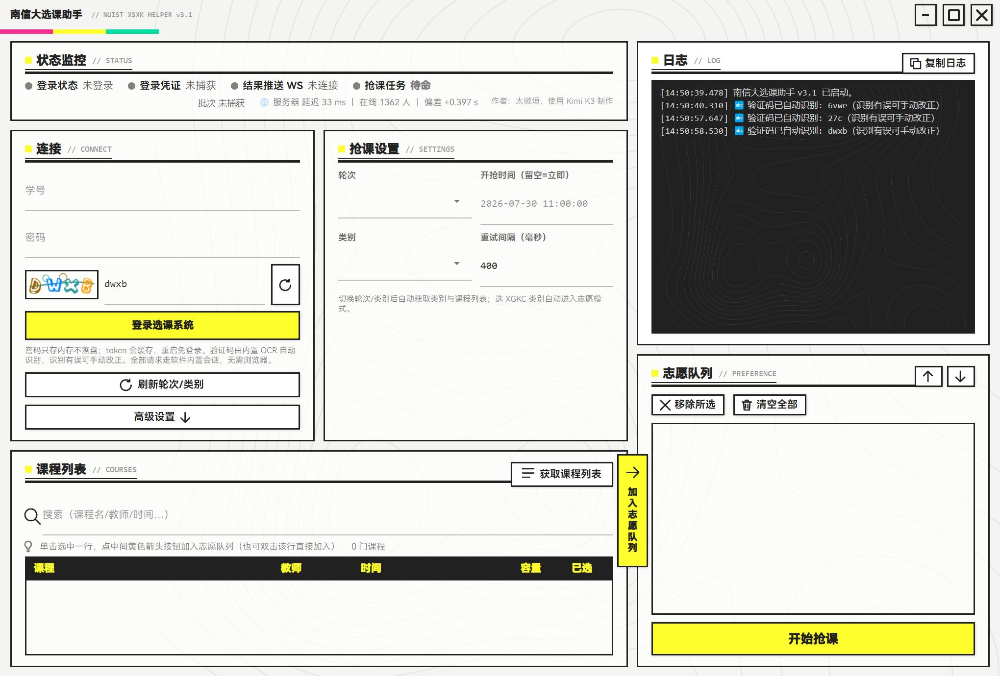

# 南信大选课助手（nuist-xsxk-helper）

南信大（NUIST）选课系统的自动化抢课工具。**当前版本 v3.1**：Avalonia 单进程应用（C#），无边框窗口 + 终末地工业风 UI（亮黄 `#FEFE2C` × 重黑 `#212121`），鸿蒙黑体已内嵌。**v3.0 起彻底移除浏览器依赖**——登录、切轮次、拉列表、抢课全部走软件内置的 HTTP 会话；**v3.1 起内置 OCR**，验证码自动识别自动填写，从登录到抢课全程不用开浏览器、不用盯屏幕。支持多备选志愿队列、定时开抢、满员自动切备选、通识课志愿填报，抢课结果以 **WebSocket 服务器推送** 为最终裁决。

> 作者：太微垣，使用 Kimi K3 制作



## 下载

👉 到 [**Releases**](../../releases) 下载最新压缩包，解压后双击 **南信大选课助手.exe** 即可。

- 运行环境：Windows 10 1809+，64 位
- **零安装**：.NET 8 运行时、鸿蒙黑体、OCR 模型全部内置
- 首次启动 Windows 可能提示"未知发布者"，点【仍要运行】
- 登录 token 与课程缓存保存在 exe 旁的 `xsxk_cache.json`（分享压缩包时请删除）

## 功能

- 🔤 **验证码自动识别（v3.1）**：内置 OCR 引擎（ddddocr 模型的 C# 移植，ONNX Runtime 本地推理，**全程不联网**），拉取验证码即自动识别填入；识别结果限定数字+字母，屏蔽汉字误识别；识别有误可手动改正
- 🔁 **登录自动重试**：因识别误差登录失败时，自动换新验证码重新识别再登，最多 3 轮，正常情况一次通过
- 🔑 **软件内登录**：密码用校方前端同款 AES-128-ECB 加密提交，**只存内存不落盘**；token 自动缓存，重启免登录；学号/密码/验证码输入框默认禁用中文输入法
- 🚀 **定时开抢**：按服务器校时倒计时，到点自动发起；开抢瞬间自动把服务器会话切到目标轮次（未放行就每秒重试）
- 📋 **志愿队列**：多门备选，第 1 志愿满员自动切第 2 志愿，可手动调整顺序；**按轮次独立记忆**，切回来自动恢复
- 📡 **WebSocket 结果推送**：`/add` 只是进队列，真正"选课成功/课容量已满"由服务器 WS 推送，收到满员立刻切备选，不做无效等待
- 🏫 **通识选修课（XGKC）**：选 XGKC 类别自动进入志愿模式，自动寻找可用志愿级别
- 📦 **本地缓存**：轮次/类别/课程列表拉成功一次就缓存，轮次未开始或网络拥堵时照样能看课、排志愿、定时开抢——**高峰期网页打不开也照样抢**
- 🔁 **轮次/类别全自动**：选轮次自动切换服务器批次并加载类别，选类别自动加载课程列表
- 📊 **实时状态**：登录 / 凭证 / WS / 任务四指示灯，在线人数、网络延迟、服务器校时一目了然
- 🎨 **工业风界面**：无边框自绘标题栏、悬浮「加入志愿队列」按钮、半透明卡片 + 等高线纹理背景、内嵌鸿蒙黑体

## 使用

1. 双击【南信大选课助手.exe】
2. 左侧【连接】卡片输入**学号、密码**，点【登录选课系统】——**验证码已自动识别填好**，识别有误手动改正即可；登录失败会自动换验证码重试
   - 登录成功后表单自动折叠，要重新登录点「已登录，点这里重新登录」即可
3. 选【轮次】→ 选【类别】，课程列表自动加载（轮次未开始会显示本地缓存）
4. 单击选中课程行，点课程列表与志愿队列之间的**黄色悬浮按钮**加入志愿（也可双击课程行直接加入；可加多个备选，↑↓ 调整顺序）
5. 确认开抢时间与重试间隔，点【开始抢课】
6. 看日志：`🎉 选课成功` 才是真的选上

## 原理速览

```
Avalonia 单进程（C#，零浏览器）
 ├─ SessionClient ：进程级 Cookie 罐（≈ requests.Session），登录后所有请求同会话
 │    ├─ POST /auth/captcha       （拉验证码图片 + uuid）
 │    ├─ POST /auth/login         （AES-128-ECB 加密密码 → 拿 token）
 │    ├─ POST /elective/user      （切轮次：body 带 batchId、头不带 batchid）
 │    ├─ GET  grablessons?batchId=（导航风格头取页，解析类别）
 │    └─ POST /elective/clazz/add （进选课队列）
 ├─ CaptchaOcr   ：内置 OCR（ONNX Runtime），验证码 → 字符序列（v3.1）
 ├─ WsListener   ：WSS  /xsxk/websocket/{学号} （服务器推送最终裁决）
 ├─ CacheStore   ：xsxk_cache.json（轮次/类别/课程/token 本地缓存）
 └─ 校时循环     ：POST /web/now              （服务器校时 + 在线人数）
```

- 服务器会话由登录响应种下的会话 Cookie 维持（CookieContainer 自动累积回放），这就是 v3.0 不需要浏览器的根本原因
- 切轮次时 `POST /elective/user` 若带 `batchid` **请求头**会被服务器按"头与会话不一致"拒绝——body 带目标 batchId 即可（v2.x 直连失败的具体原因）
- 学号从 token（JWT 的 `login_user_key`）自动解析，无需手填

## OCR 验证码识别原理（v3.1）

模型来自 [ddddocr](https://github.com/sml2h3/ddddocr)（MIT）的 `common_old.onnx`（13.6 MB，CNN+CTC 验证码模型），配 8209 项字符集，随软件内嵌，**推理全程本地，不产生任何额外网络请求**。`Core/CaptchaOcr.cs` 是对 ddddocr Python 管线的逐行 C# 移植：

```
验证码 PNG/JPG 字节
  → Avalonia Bitmap 解码为 BGRA 像素
  → BT.601 加权灰度化（0.299R + 0.587G + 0.114B，归一化 /255）
  → 高度 64px 等比缩放（双线性插值，宽度 = 原宽 × 64 / 原高）
  → 组装 [1, 1, 64, W] float32 张量
  → ONNX Runtime 推理，输出 [1, T, C]（T 时间步 × C 字符类别）
  → 每时间步 argmax 取最高概率类别
  → CTC 解码：索引层去连续重复 → 剔除 blank（索引 0）→ 查字符集
  → 4 位验证码字符串
```

两个针对教务系统的定制：

1. **数字+字母类别掩码**：教务验证码只含数字与字母，解码时在 argmax 阶段直接屏蔽字符集中的汉字类别（只允许 `[0-9A-Za-z]` 与 blank 参与竞争），避免形近汉字（如"了/3"、"认/R"）抢占最高概率位，显著降低误识别率。注意必须在 argmax **之前**掩码，事后过滤会丢字符。
2. **模型选型**：ddddocr 同时提供 54MB 的 `common.onnx`（新版默认模型），实测在本教务系统验证码上几乎全错——新模型字符集排序与旧版不兼容，故选用旧版 `common_old.onnx`，实测识别率接近 100%。

识别错误时的兜底：登录失败自动刷新验证码重新识别，最多 3 轮；用户也可随时手动改正输入框内容。

## 从源码构建

需要 **.NET 8 SDK**：

```bash
cd XsxkAvalonia
dotnet build                       # 开发运行（输出 bin/Debug/net8.0/）

# 单文件自包含发布（免安装 .NET）
dotnet publish -c Release -r win-x64 --self-contained \
  -p:PublishSingleFile=true -p:IncludeAllContentForSelfExtract=true
```

## 目录结构

```
XsxkAvalonia/   当前版本源码（Avalonia 12 / net8.0 / C#）
 ├─ Core/       SessionClient、GrabEngine、WsListener、CaptchaOcr、CacheStore、Logic
 ├─ Views/      主窗口 XAML（工业风 UI）
 └─ Assets/     鸿蒙黑体、OCR 模型与字符集、背景纹理
docs/           界面截图
legacy/         历史版本存档（不再维护，仅供考古）
 ├─ course-grab.user.js   最初的油猴连点器脚本
 ├─ xsxk_app.py           v1.x Python 版（tkinter）
 ├─ headless_grabber.py   无界面抢课原型
 ├─ mock_server.py        本地测试服务器
 ├─ backups/              v1.0 完整备份
 └─ XsxkWinUI/            WinUI3 前端尝试（已废弃）
```

## 历史版本

- `v3.1`（[pre-release](../../releases/tag/v3.1)）— 内置 OCR 验证码自动识别
- `v3.0`（[Release](../../releases/tag/v3.0)）— 纯 HTTP 会话版，彻底移除浏览器依赖
- `v2.2`（[Release](../../releases/tag/v2.2)）— 内置 Chromium 自动捕获版（Playwright），已被 v3.0 取代
- `v2.1` — 工业风 UI 改版
- `v2.0` — Avalonia 重构首版
- `v1.1`（[Release](../../releases/tag/v1.1)）— WinUI3 前端 + Python 后端双进程版，已停止维护

## 开源许可

本项目以 [MIT License](LICENSE) 开源。

第三方组件（均为 MIT 许可）：
- [ddddocr](https://github.com/sml2h3/ddddocr) — OCR 模型与字符集（`common_old.onnx`）
- [ONNX Runtime](https://github.com/microsoft/onnxruntime) — 本地推理引擎
- [Avalonia](https://github.com/AvaloniaUI/Avalonia) — 跨平台 UI 框架

## 致谢

- [YoungUsing/xsxk-nuist](https://github.com/YoungUsing/xsxk-nuist)（纯 HTTP 会话、导航风格头切轮次、OCR 验证码思路）
- [airline233/nuist-xsxk](https://github.com/airline233/nuist-xsxk)（登录/验证码 API、`POST /elective/user` 切轮次、WebSocket 推送机制的启发）

## 免责声明

本工具仅供学习交流使用，请遵守学校选课相关规定，合理控制请求频率，由此产生的一切后果由使用者自行承担。
