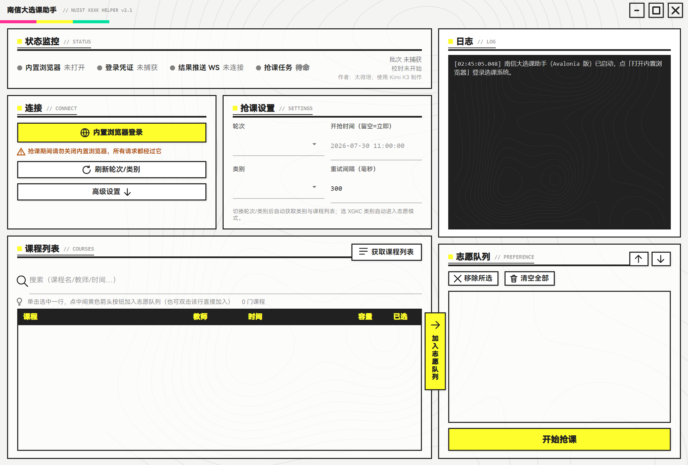

# 南信大选课助手（nuist-xsxk-helper）

南信大（NUIST）选课系统的自动化抢课工具。**当前版本 v2.1**：Avalonia 单进程应用（C#），无边框窗口 + 终末地工业风 UI（亮黄 `#FEFE2C` × 重黑 `#212121`），鸿蒙黑体已内嵌。支持多备选志愿队列、定时开抢、满员自动切备选、通识课志愿填报，抢课结果以 **WebSocket 服务器推送** 为最终裁决。

> 作者：太微垣，使用 Kimi K3 制作



## 下载

👉 到 [**Releases**](../../releases) 下载 `nuist-xsxk-helper-v2.1-win-x64.zip`，解压后双击 **南信大选课助手.exe** 即可。

- 运行环境：Windows 10 1809+，64 位
- **零安装**：.NET 8 运行时、便携 Chromium、鸿蒙黑体字体全部内置（首次自解压约 10 秒属正常）
- 首次启动 Windows 可能提示"未知发布者"，点【仍要运行】
- 登录态保存在 exe 旁的 `.browser-profile\` 文件夹（分享压缩包时请勿带上）

## 功能

- 🚀 **定时开抢**：按服务器校时倒计时，到点自动发起
- 📋 **志愿队列**：多门备选，第 1 志愿满员自动切第 2 志愿，可手动调整顺序
- 📡 **WebSocket 结果推送**：`/add` 只是进队列，真正"选课成功/课容量已满"由服务器 WS 推送，收到满员立刻切备选，不做无效等待
- 🏫 **通识选修课（XGKC）**：选 XGKC 类别自动进入志愿模式，自动寻找可用志愿级别
- 🌐 **内置便携 Chromium**：登录后 token / 轮次 / 类别 / 课程列表**全自动捕获**，无需手动导入任何配置——**高峰期网页打不开也照样抢**
- 📊 **实时状态**：浏览器 / 凭证 / WS / 任务四指示灯，在线人数、网络延迟、服务器校时一目了然
- 🔁 **轮次/类别全自动**：选轮次自动导航切换服务器批次并加载类别，选类别自动加载课程列表
- 🎨 **v2.1 新界面**：无边框自绘标题栏、悬浮「加入志愿队列」按钮、半透明卡片 + 等高线纹理背景、内嵌鸿蒙黑体（无字体环境也正常显示）

## 使用

1. 双击【南信大选课助手.exe】
2. 点【内置浏览器登录】，在弹出的浏览器里登录选课系统
   - ⚠️ 抢课期间请勿关闭该浏览器窗口，所有请求都经过它
3. 状态指示灯变绿后，选【轮次】→ 选【类别】，课程列表自动加载
4. 单击选中课程行，点课程列表与志愿队列之间的**黄色悬浮按钮**加入志愿（也可双击课程行直接加入；可加多个备选，↑↓ 调整顺序）
5. 确认开抢时间与重试间隔，点【开始抢课】
6. 看日志：`🎉 选课成功` 才是真的选上

## 原理速览

```
Avalonia 单进程（C#）
 ├─ BrowserPump  ：内置 Chromium（Playwright 持久化会话，捕获 token/batchId）
 ├─ XsxkClient   ：POST /elective/clazz/add   （进选课队列）
 ├─ WsListener   ：WSS  /xsxk/websocket/{学号} （服务器推送最终裁决）
 └─ 校时循环     ：POST /web/now              （服务器校时 + 在线人数）
```

- 浏览器在线时所有 API 请求走页面内 `fetch`（携带完整会话），浏览器挂掉自动降级直连
- 切换轮次必须通过浏览器**顶层页面导航**（`grablessons?batchId=…`），普通 XHR 会被服务器踢回登录页
- 学号从 JWT 的 `login_user_key` 字段自动解析，无需手填

## 从源码构建

需要 **.NET 8 SDK**：

```bash
cd XsxkAvalonia
dotnet build                       # 开发运行（输出 bin/Debug/net8.0/）

# 单文件自包含发布（免安装 .NET，约 200 MB）
dotnet publish -c Release -r win-x64 --self-contained \
  -p:PublishSingleFile=true -p:IncludeAllContentForSelfExtract=true
```

浏览器内核首次使用需执行一次 `pw install chromium`（Playwright），或把发行包里的 `pw-browsers\` 文件夹放到 exe 旁边（程序会优先使用便携目录）。

## 历史版本

- `v2.0` — Avalonia 重构首版（Material Design 界面）
- `v1.1`（[Release](https://github.com/TaiWeiYuan325/nuist-xsxk-helper/releases/tag/v1.1)）— WinUI3 前端 + Python 后端双进程版，已停止维护
- `course-grab.user.js` — 最初的油猴连点器脚本
- `headless_grabber.py` + `mock_server.py` — 无界面抢课原型与本地测试服务器
- `backups/v1.0-20260730/` — v1.0（tkinter 界面）完整备份

## 致谢

- [YoungUsing/xsxk-nuist](https://github.com/YoungUsing/xsxk-nuist)
- [airline233/nuist-xsxk](https://github.com/airline233/nuist-xsxk)（WebSocket 推送机制的启发）

## 免责声明

本工具仅供学习交流使用，请遵守学校选课相关规定，合理控制请求频率，由此产生的一切后果由使用者自行承担。
